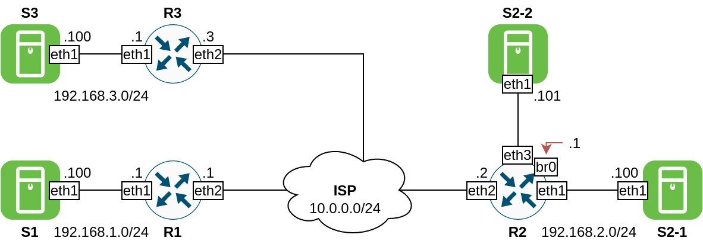

### Стенд для занятия по bridge/tunnel/VPN

Попробуйте настроить разные туннели ориентируясь на приведенную ниже схему.
Конечная маршрутизация должна работать во все стороны. Доступ в Интернет обеспечивать необязательно, но приветствуется.
На стенде уже сразу настроен и работает туннель IPSec между R2 и R3.



### Пример конфигурации bridge
```
brctl addbr bridge0
brctl addif bridge0 eth0
ip link set up dev bridge0
brctl show
```
или так:
```
ip link add name bridge0 type bridge
ip link set bridge0 up
ip link set eth0 up
ip link set eth0 master bridge0
bridge link
```
или файлами:
- [ifcfg-bridge0](provisioning/templates/ifcfg-bridge0.j2)
- [fcfg-eth1](provisioning/templates/ifcfg-eth1.j2)


### Пример конфигурации GRE

```
modprobe ip_gre
ip tunnel add tun0 mode gre remote <REMOTE_IP> local <LOCAL_IP> dev eth0
ip address add <TUNNEL_LOCAL_IP>/<TUNNEL_LOCAL_NETMASK> dev tun0
ifconfig tun0 mtu 1476 up
```

### Пример конфигурации OpenVPN

Пример генерации простого CA и файлов ключей/сертификатов (**в проде так не делать!**):
```
yum install epel-release
yum install easy-rsa
./easyrsa clean-all # Очищаем существующую инфраструктуру
./easyrsa init-pki # Инициализируем новую инфраструктуру
./easyrsa build-ca nopass # Генерируем корневую ключевую пару и сертификат
./easyrsa build-server-full 10.0.0.3 nopass # Генерируем ключевую пару и сертификат для сервера
./easyrsa build-client-full 10.0.0.2 nopass # Генерируем ключевую пару и сертификат для клиента
./easyrsa gen-dh # Генерация ключа Диффи-Хеллмана
openvpn --genkey --secret pki/ta.key # Генерируем ключ предварительной аутентификации для TLS
```

Сервер:
```
daemon
mode server
port 10000
proto udp
dev tap
ca ca.crt
cert 10.0.0.3.crt 
key 10.0.0.3.key
dh dh.pem
#tls-auth ta.key 0
#tls-server
server 172.16.0.0 255.255.255.0
route 192.168.3.0 255.255.255.0
push "route 192.168.3.0 255.255.255.0"
ifconfig-pool-persist ipp.txt
client-config-dir ccd/
keepalive 10 120
max-clients 32
client-to-client
persist-key
persist-tun
status /var/log/openvpn/openvpn-status.log
log-append /var/log/openvpn/openvpn.log
verb 4
mute 20
```
В каталоге ccd на сервере находятся файлы по имени клиента. В данных файлах указываются сети, которые есть и должны быть доступны за клиентом(!). Пример содержимого такого файла (ccd/10.0.0.2):
```
iroute 192.168.2.0 255.255.255.0
```

Клиент:
```
client
#tls-client
remote 10.0.0.3
port 10000
proto udp
dev tap
keepalive 10 120
status /var/log/openvpn/openvpn-status.log
log-append /var/log/openvpn/openvpn.log
verb 4
mute 20
<ca>
</ca>
<cert>
</cert>
<key>
</key>
<dh>
</dh>
#key-direction 1
#<tls-auth>
#</tls-auth>
```

### Пример конфигурации IPSec для libreswan

- [/etc/ipsec.d/demo-con.conf](provisioning/templates/r2-ipsec.d.conf.j2)
- [/etc/ipsec.d/demo-con.secrets](provisioning/templates/r2-ipsec.d.secrets.j2)
- [/etc/ipsec.conf](provisioning/templates/ipsec.conf.j2)

Проверку работы IPSec можно осуществить сделав ping с S3 на S2-1 (или S2-2) и одновременно прослушивая трафик интерфейса eth2 на R2 (или R3) - там будут наблюдаться пакеты ESP.